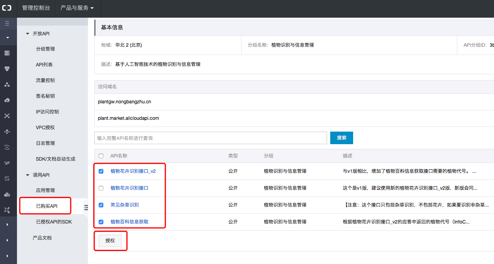
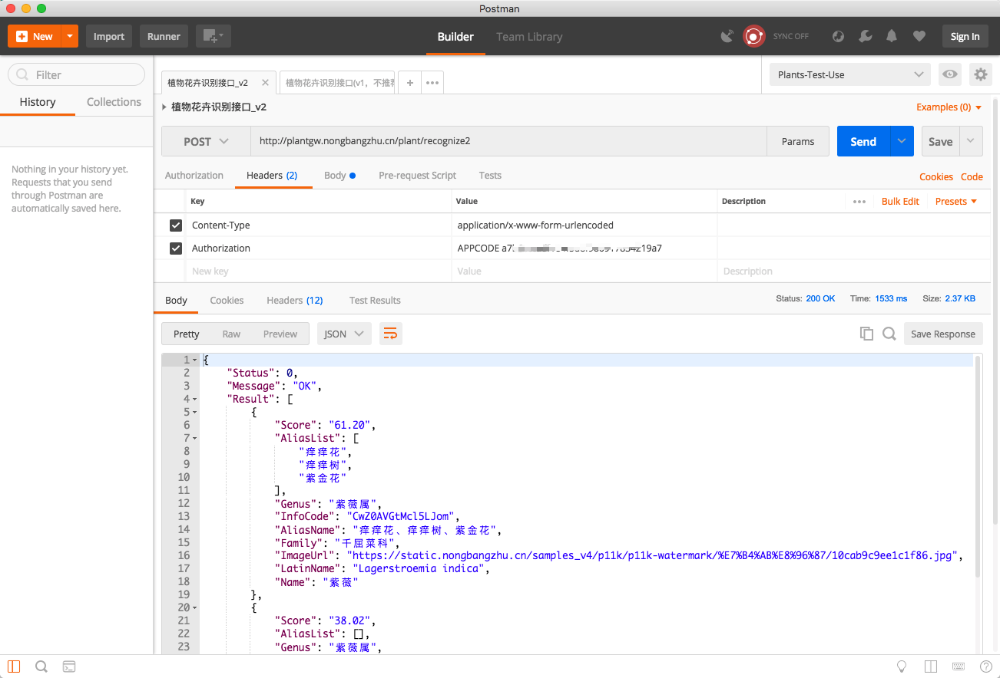
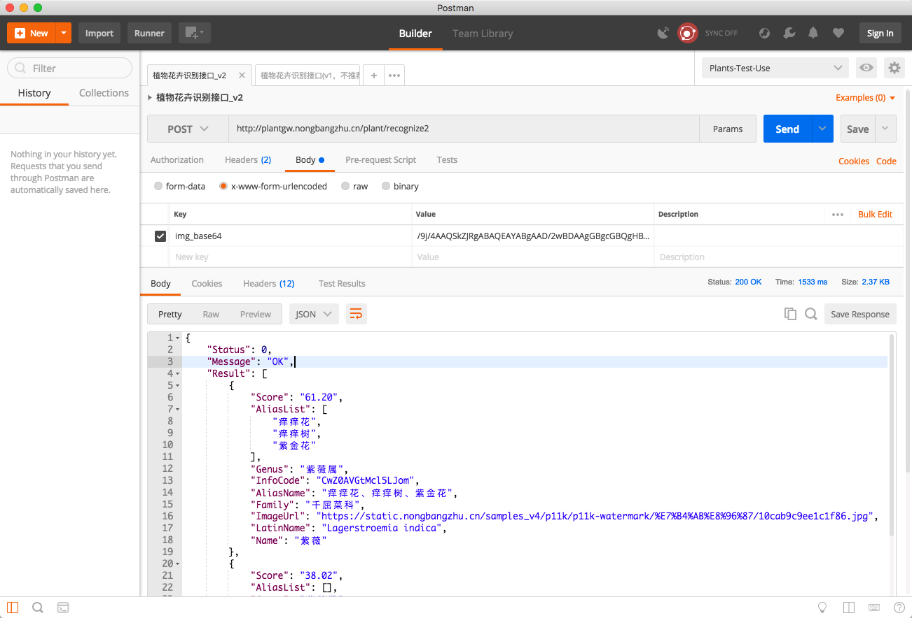
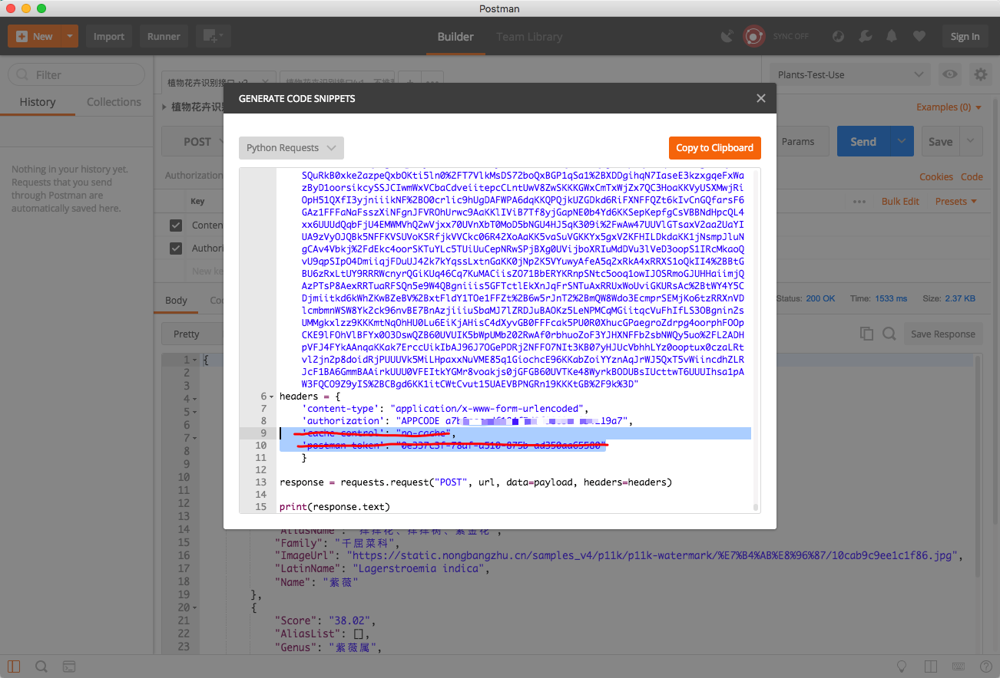

# demo-for-aliyun-plant-api

阿里云市场智能植物识别（含花卉与杂草）API的开箱即用的示例代码（ <https://market.aliyun.com/products/57124001/cmapi018620.html> ）

## 👏🏻 2019识花软件大PK，花伴侣力拔头筹 👏🏻

  详见 <https://zhuanlan.zhihu.com/p/58204875>

## 关于已购APP CODE无法用于新发布接口的问题

  阿里云市场上，我们会不定期发布新的接口，对于新的接口，如果您使用该新接口发布前购买的APP CODE，可能会出现未授权问题，解决方法是：
  登录api网关控制台：<https://apigateway.console.aliyun.com/>，
  点击【调用API】-【已购买API】，点开API详情，选中新API，点击左下方授权按钮完成授权即可。
  

## 接口对HTTPS协议的支持

  对于类似微信小程序这样，要求接口必须是HTTPS协议的，
  请将接口的协议和域名部分，从http://plantgw.nongbangzhu.cn 改成 https://plant.market.alicloudapi.com 即可

## 植物图片拍照要求

  照片尽可能拍成方形，在转换成BASE64前，要求分辨率尽可能调整到500x500，压缩比0.8，格式jpeg，尺寸小于512K。
  有些工具在将图片文件转化为BASE64编码时，会带上 "data:image/jpeg;base64," 前缀，请在调用接口时注意删除。

## Java语言示例

  请用支持pom.xml的IDE，比如IntelliJ IDEA，Eclipse打开或导入java目录。
  用JDK 1.8+运行。

### 用OkHttp库做请求

  参见代码文件：java/src/main/tld.your.company/okhttp/RequestDemoForAliyunPlantApiByOkHttp.java

### 用Apache HttpClient库做请求

  参见代码文件：java/src/main/tld.your.company/httpclient/RequestDemoForAliyunPlantApiByHttpClient.java

## JavaScript语言示例

### NodeJS版

  参见代码： javascript/node目录
  AppCode请在index.js内设置

### 浏览器内JS版

  参见代码： javascript/browser目录
  AppCode请在common.js内设置

## PHP

  参见代码： php目录
  AppCode请用每个php文件内的$appcode变量来设置

## Python（Python 2/Python 3皆可）

  参见代码： python目录

## .NET/C#

  参见代码： csharp/demofx；基于.NET Framework 4.5.2；请求基于NuGet上的RestSharp库制作。

## Android版（带拍照）

  参见代码： android目录

  使用Android Studio 3打开。SDK Manager -> SDK Tools内注意安装Support Repository下面的ConstraintLayout for Android和Solver for ConstraintLayout，必要的时候点击界面右下角的“Show Package Details”，选择需要的具体版本来安装。

## iOS版

### Objective-C语言版

  参见代码：ios/objective-x目录内的Xcode工程。
  AppCode请在ViewController.m内设置。

### Swift语言版（带拍照）

  参见代码：ios/swift目录内的Xcode工程。
  AppCode请在ViewController.swift内设置。
  识别结果请从Xcode的日志输出中查看。

## 其他语言示例

  可使用POSTMAN（ <https://www.getpostman.com/> ）工具构建好请求后，通过POSTMAN的code查看功能，查看到各语言的请求示例代码。

  
  
  
  

## 常见错误和解决方法

### 应答码 401

  用户AppCode输入不对或过期。如果是过期需重新购买。

### 应答码 403

  应答体为：
  {"Status":1002,"Message":"The parameter img_base64 is not base64 ","Result":[]}

  可能的原因包括：
  （1）转化后的BASE64编码带 "data:image/jpeg;base64," 前缀，但在请求时没有去掉
  （2）BASE64编码中的加号（+）没有被转化为 %2B

### 返回HTML 413

  识别接口返回如下的HTML

  ``` HTML
  <html>
      <head>
          <title>413 Request Entity Too Large</title>
      </head>
      <body bgcolor="white">
          <center>
              <h1>413 Request Entity Too Large</h1>
          </center>
          <hr>
          <center>nginx</center>
      </body>
  </html>
  ```

  原因：
    向接口传递的图片超过1M，需要做控制。传入图片尽量控制在100-200K以内。